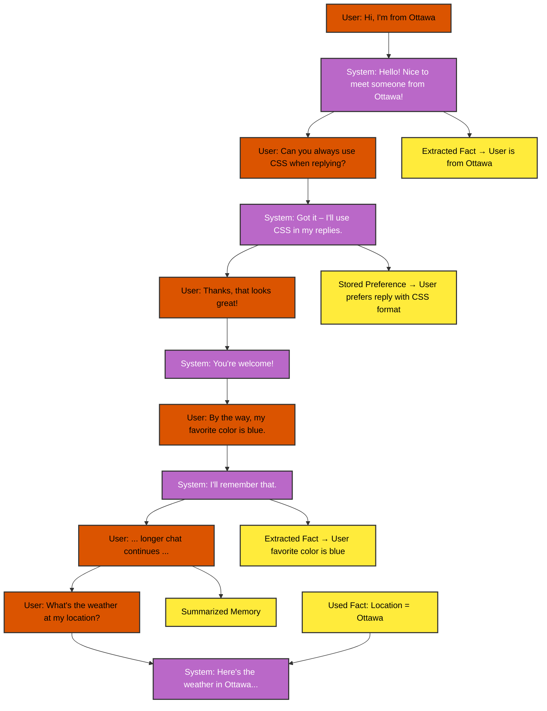

# Long-Term Memory in Agentic AI Systems with Solace Agent Mesh (SAM) 

## What is Solace Agent Mesh (SAM)? 

Solace Agent Mesh (SAM) is an open-source agentic framework purpose-built to help you create collaborative AI systems that can interact with real-world data and systems in a flexible, event-driven way. 

Rather than being a monolithic AI platform, SAM is a composable, scalable integration layer for AI agents. It connects agents, data sources, and gateways so they can work together to solve complex tasks. 


## What is Memory in Agentic Frameworks? 

In traditional AI applications, memory is often short-lived, limited to a single session or context window. But agentic systems need more than that. They need to remember who they’re working with, what’s been said before, what goals have been set, and what preferences have been shared. 

This is where SAM’s long-term memory architecture shines. 

SAM introduces a memory model that stores information across sessions and agents, enabling adaptive behavior, continuity, and context preservation over time. 

### Why Memory Matters 

- Context Preservation: Conversations don’t start from scratch every time. 

- Adaptive Behavior: The system can adjust based on learned facts and instructions. 

- Efficient Collaboration: Instruction sets, and user information would not need to be repeated every time. 

- Human-Centric UX: Makes AI feel more intelligent, personal, and useful.


## SAM’s Memory Architecture 

SAM organizes information into four core types: 

- Learned Facts: Persistent knowledge about the user or environment (e.g., "User lives in Toronto"). 

- Learned Instructions: User-defined preferences, behaviors, and custom rules (e.g., "Always reply formally"). 

- Active Session History: The recent ongoing conversation context. 

- Summary of Old Session History: Compressed summaries of prior interactions to retain meaning without consuming memory. 

LLMs are used behind the scenes to automatically extract and organize this information. As sessions get longer, older data is summarized, prioritizing relevance, just like a human would do when remembering long conversations.


## How to Enable Memory in SAM Projects 

In the [gateway.yaml](./configs/gateways/rest_api/gateway.yaml) configuration file of your gateway, update the `history_policy` section with the following values: 

```yaml
- history_policy: &default_history_policy
    # ... Some other Configs ...
    enable_long_term_memory: true # Enables the long-term memory feature
    long_term_memory_config: # Required if enable_long_term_memory is set to true
      summary_time_to_live: 432000 # How long to keep the session summary before forgetting, default 5 Days in seconds
      llm_config: # LLM configuration to be used for the AI features of the long-term memory
        model: ${LLM_SERVICE_PLANNING_MODEL_NAME}
        api_key: ${LLM_SERVICE_API_KEY}
        base_url: ${LLM_SERVICE_ENDPOINT}
      store_config: # Configuration for storing long-term memory
        type: "file" # History Provider
        # Other configs required for the history provider
        path: /tmp/history  # Required for file history provider
```

You can use any of the built-in history providers or implement your own. The following history providers are available:
- In-memory (fast but ephemeral)
- File system
- Redis
- MongoDB
- SQL databases


